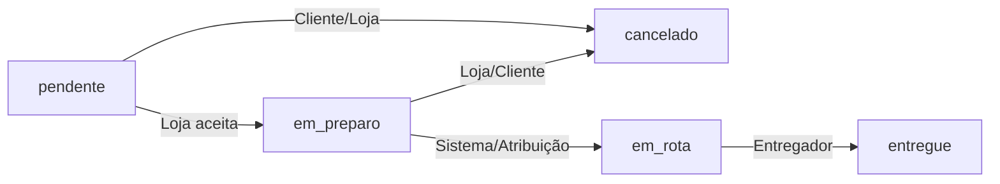

# ⚡ Guia Completo de Integração com a Rapidão Delivery API

> Guia oficial para desenvolvedores Frontend (React, Vue, Mobile/Flutter, iOS/Android) integrarem suas aplicações com a **Rapidão Delivery API**.

---

## 📋 Sumário
1. [Visão Geral & Padrão de Resposta](#1-visão-geral--padrão-de-resposta)
2. [Autenticação & Controle de Acesso (RBAC)](#2-autenticação--controle-de-acesso-rbac)
3. [Módulo 1: Autenticação & Usuários (`auth` & `user`)](#3-módulo-1-autenticação--usuários-auth--user)
4. [Módulo 2: Lojas & Cardápios (`store` & `product`)](#4-módulo-2-lojas--cardápios-store--product)
5. [Módulo 3: Cálculo de Frete (`freight`)](#5-módulo-3-cálculo-de-frete-freight)
6. [Módulo 4: Pedidos & Máquina de Estados (`order`)](#6-módulo-4-pedidos--máquina-de-estados-order)
7. [Módulo 5: Entregas & Geolocalização (`delivery`)](#7-módulo-5-entregas--geolocalização-delivery)
8. [Módulo 6: WebSockets & Notificações em Tempo Real (`notification`)](#8-módulo-6-websockets--notificações-em-tempo-real-notification)
9. [Tabela Consolidada de Rotas da API](#9-tabela-consolidada-de-rotas-da-api)

---

## 1. Visão Geral & Padrão de Resposta

Toda a API responde sob o prefixo `/api/v1` e utiliza um **envelope JSON unificado** para respostas de sucesso e erro.

### Envelope de Sucesso (`HTTP 200 / 201`)
```json
{
  "status": "success",
  "message": "Operação realizada com sucesso.",
  "data": { ... }
}
```

### Envelope de Erro (`HTTP 400 / 401 / 403 / 404 / 422 / 500`)
```json
{
  "status": "error",
  "message": "Mensagem descritiva do erro.",
  "details": null
}
```

### Headers Padrão em todas as requisições:
```http
Authorization: Bearer <access_token>
Content-Type: application/json
X-Correlation-ID: <uuid_opcional_para_rastreabilidade>
```

---

## 2. Autenticação & Controle de Acesso (RBAC)

A plataforma aceita 4 papéis (`roles`) de usuário:
- **`client`**: Cliente final que realiza pedidos.
- **`store`**: Proprietário de loja que administra cardápios e pedidos da sua loja.
- **`deliverer`**: Entregador que envia pings de localização e realiza entregas.
- **`admin`**: Administrador da plataforma (Super-acesso a todas as rotas).

---

## 3. Módulo 1: Autenticação & Usuários (`auth` & `user`)

### 3.1 `POST /api/v1/auth/register` — Registro de Novo Usuário
- **Acesso**: Público
- **Body**:
```json
{
  "email": "cliente@email.com",
  "password": "sua_senha_segura",
  "full_name": "Nome Completo",
  "role": "client" // Opções: client, store, deliverer
}
```
- **Resposta (`HTTP 201`)**:
```json
{
  "status": "success",
  "message": "Usuário registrado com sucesso.",
  "data": {
    "id": "c1f2e3d4-5678-90ab-cdef-1234567890ab",
    "email": "cliente@email.com",
    "full_name": "Nome Completo",
    "role": "client",
    "is_active": true
  }
}
```

---

### 3.2 `POST /api/v1/auth/login` — Autenticação (Login)
- **Acesso**: Público
- **Body (`application/json` ou `x-www-form-urlencoded`)**:
```json
{
  "email": "cliente@email.com",
  "password": "sua_senha_segura"
}
```
- **Resposta (`HTTP 200`)**:
```json
{
  "status": "success",
  "message": "Login realizado com sucesso.",
  "data": {
    "access_token": "eyJhbGciOiJIUzI1NiIsIn...",
    "refresh_token": "eyJhbGciOiJIUzI1NiIsIn...",
    "token_type": "bearer"
  }
}
```

---

### 3.3 `GET /api/v1/auth/me` — Obter Dados do Usuário Logado
- **Acesso**: Requer Autenticação (`client`, `store`, `deliverer`, `admin`)
- **Headers**: `Authorization: Bearer <access_token>`
- **Resposta (`HTTP 200`)**:
```json
{
  "status": "success",
  "message": "Perfil obtido com sucesso.",
  "data": {
    "id": "c1f2e3d4-5678-90ab-cdef-1234567890ab",
    "email": "cliente@email.com",
    "full_name": "Nome Completo",
    "role": "client"
  }
}
```

---

### 3.4 `POST /api/v1/auth/logout` — Logout & Revogação de Token
- **Acesso**: Requer Autenticação
- **Headers**: `Authorization: Bearer <access_token>`
- **Resposta (`HTTP 200`)**:
```json
{
  "status": "success",
  "message": "Logout realizado com sucesso. Token revogado."
}
```

---

## 4. Módulo 2: Lojas & Cardápios (`store` & `product`)

### 4.1 `GET /api/v1/stores` — Listar Lojas Ativas
- **Acesso**: Público (Cacheado no Redis)
- **Resposta (`HTTP 200`)**:
```json
{
  "status": "success",
  "message": "Lojas encontradas com sucesso.",
  "data": [
    {
      "id": "d1e2f3a4-1111-2222-3333-444455556666",
      "name": "Hamburgueria Express",
      "description": "Os melhores hambúrgueres artesanais",
      "category": "Lanches",
      "address": "Av. Paulista, 1000",
      "latitude": -23.5615,
      "longitude": -46.6558,
      "is_active": true
    }
  ]
}
```

---

### 4.2 `GET /api/v1/stores/{store_id}/products` — Cardápio da Loja
- **Acesso**: Público (Cacheado no Redis sob a chave `store:{id}:menu`)
- **Resposta (`HTTP 200`)**:
```json
{
  "status": "success",
  "message": "Cardápio obtido com sucesso.",
  "data": [
    {
      "id": "p1p2p3p4-1111-2222-3333-444455556666",
      "store_id": "d1e2f3a4-1111-2222-3333-444455556666",
      "name": "Smash Burger Duplo",
      "description": "Dois hambúrgueres de 100g, queijo cheddar e molho da casa",
      "price": 28.90,
      "category": "Lanches",
      "is_active": true
    }
  ]
}
```

---

## 5. Módulo 3: Cálculo de Frete (`freight`)

### 5.1 `POST /api/v1/freight/calculate` — Simular Frete no Carrinho
- **Acesso**: Requer Autenticação (`client`, `admin`)
- **Body**:
```json
{
  "store_latitude": -23.5615,
  "store_longitude": -46.6558,
  "delivery_latitude": -23.5700,
  "delivery_longitude": -46.6400
}
```
- **Resposta (`HTTP 200`)**:
```json
{
  "status": "success",
  "message": "Cálculo de frete efetuado.",
  "data": {
    "distance_km": 1.85,
    "freight_value": 7.78
  }
}
```
> **Nota de Performance**: Resultados de distância entre coordenadas idênticas são servidos do cache Redis (`distance:lat1:lng1:lat2:lng2`) em **< 5ms**.

---

## 6. Módulo 4: Pedidos & Máquina de Estados (`order`)

### 6.1 Fluxo da Máquina de Estados do Pedido


---

### 6.2 `POST /api/v1/orders` — Criar Novo Pedido
- **Acesso**: Requer Papel `client`
- **Body**:
```json
{
  "store_id": "d1e2f3a4-1111-2222-3333-444455556666",
  "items": [
    { "product_id": "p1p2p3p4-1111-2222-3333-444455556666", "quantity": 2 }
  ],
  "delivery_address": "Rua das Flores, 123 - Apt 42",
  "delivery_latitude": -23.5700,
  "delivery_longitude": -46.6400
}
```
- **Resposta (`HTTP 201`)**:
```json
{
  "status": "success",
  "message": "Pedido criado com sucesso.",
  "data": {
    "id": "o1o2o3o4-9999-8888-7777-666655554444",
    "client_id": "c1f2e3d4-5678-90ab-cdef-1234567890ab",
    "store_id": "d1e2f3a4-1111-2222-3333-444455556666",
    "deliverer_id": null,
    "status": "pendente",
    "total_amount": 65.58,
    "freight_value": 7.78,
    "delivery_address": "Rua das Flores, 123 - Apt 42",
    "items": [
      {
        "product_id": "p1p2p3p4-1111-2222-3333-444455556666",
        "product_name": "Smash Burger Duplo",
        "unit_price": 28.90,
        "quantity": 2,
        "subtotal": 57.80
      }
    ]
  }
}
```

---

### 6.3 `PATCH /api/v1/orders/{order_id}/status` — Atualizar Status do Pedido
- **Acesso**: Requer Papel Autorizado
- **Body**:
```json
{
  "status": "em_preparo"
}
```

---

## 7. Módulo 5: Entregas & Geolocalização (`delivery`)

### 7.1 `PATCH /api/v1/deliverers/me/location` — Ping de Geolocalização do Entregador
- **Acesso**: Requer Papel `deliverer`
- **Body**:
```json
{
  "latitude": -23.5650,
  "longitude": -46.6500,
  "is_available": true
}
```

---

### 7.2 `POST /api/v1/deliverers/orders/{order_id}/assign` — Atribuição Atômica de Entregador
- **Acesso**: Requer Papel `store` ou `admin`
- **Descrição**: Seleciona e trava via `SELECT FOR UPDATE` o entregador disponível livre mais próximo da loja (calculado via Haversine) e avança o pedido para `em_rota`.
- **Resposta (`HTTP 200`)**:
```json
{
  "status": "success",
  "message": "Entregador atribuído com sucesso e pedido em rota de entrega.",
  "data": {
    "order_id": "o1o2o3o4-9999-8888-7777-666655554444",
    "deliverer_id": "u9u8u7u6-1111-2222-3333-444455556666",
    "status": "em_rota",
    "message": "Entregador atribuído com sucesso."
  }
}
```

---

### 7.3 `POST /api/v1/deliverers/orders/{order_id}/complete` — Concluir Entrega
- **Acesso**: Requer Papel `deliverer` (atribuído ao pedido) ou `admin`
- **Descrição**: Altera o status do pedido para `entregue` e libera o entregador (`is_busy = false`).

---

## 8. Módulo 6: WebSockets & Notificações em Tempo Real (`notification`)

### 8.1 Conexão WebSocket Rastreamento de Pedido em Tempo Real
- **URL**: `ws://localhost:8000/ws/orders/{order_id}`
- **Protocolo**: WebSocket nativo

#### Exemplo de Código Frontend (JavaScript / React):
```javascript
const orderId = "o1o2o3o4-9999-8888-7777-666655554444";
const ws = new WebSocket(`ws://localhost:8000/ws/orders/${orderId}`);

ws.onopen = () => {
  console.log("Conectado ao canal de atualizações ao vivo do pedido!");
};

ws.onmessage = (event) => {
  const data = JSON.parse(event.data);
  console.log("Evento recebido em tempo real:", data);
  // Exemplo de payload recebido:
  // {
  //   "event_type": "STATUS_CHANGED",
  //   "order_id": "o1o2o3o4-...",
  //   "payload": { "new_status": "em_rota", "deliverer_id": "..." }
  // }
};
```

---

## 9. Tabela Consolidada de Rotas da API

| Método | Endpoint | Descrição | Permissão (Role) |
|---|---|---|---|
| `POST` | `/api/v1/auth/register` | Registrar conta de usuário | Público |
| `POST` | `/api/v1/auth/login` | Efetuar login e obter tokens JWT | Público |
| `GET` | `/api/v1/auth/me` | Obter dados da conta conectada | Autenticado |
| `POST` | `/api/v1/auth/logout` | Revogar token atual e encerrar sessão | Autenticado |
| `GET` | `/api/v1/stores` | Listar lojas ativas | Público |
| `GET` | `/api/v1/stores/{id}/products` | Listar cardápio da loja (Cache Redis) | Público |
| `POST` | `/api/v1/freight/calculate` | Simular valor de frete por Haversine | Client / Admin |
| `POST` | `/api/v1/orders` | Criar novo pedido de compra | Client |
| `GET` | `/api/v1/orders` | Histórico de pedidos do usuário | Client/Store/Deliverer |
| `PATCH` | `/api/v1/orders/{id}/status` | Transitar status do pedido | Permitido pela matriz |
| `PATCH` | `/api/v1/deliverers/me/location` | Enviar ping de localização GPS | Deliverer |
| `POST` | `/api/v1/deliverers/orders/{id}/assign` | Atribuição atômica de entregador | Store / Admin |
| `POST` | `/api/v1/deliverers/orders/{id}/complete` | Confirmar entrega realizada | Deliverer / Admin |
| `WS` | `/ws/orders/{id}` | Escuta reativa de eventos via WebSocket | Público / Client |
